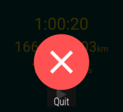

Gambarumeter is an Android application that tracks your heart rates, running distance and stepcount.
Smartphones with Android 4.3 or newer and smartwatch with Android Wear are required to install this app.
This app works standalone. It's not necessary to carry smartphones.

## Smartwatch

### Main view

Main view is shown when launched.

If you tap the button at the bottom of the screen or double-tap somewhere on the screen, the app starts tracking your activity.
The app stops tracking if you tap the same button or double-tap somewhere.

You have to turn on sensors before launching this app.
Go to *Settings -> Permissions -> Gambarumeter*.

Distance is shown "-.--" at first. It turns to "0.00" when the device acquired satellite signals.

Long press somewhere on the screen if you want to terminate this app.

### History view

You can view your workout history by swiping left.

History view has view mode and edit mode.
In view mode, tap a list item to see the detail of it.

In edit mode, tap a list item to delete it.

Mode is changed by tapping "View mode" or "Edit mode".

### Notification

Ongoing notification appears on the watch face. Tap it to open main view.

### Voice command

Voice commands are available if your smartwatch is connected with your smartphone.

"Start running" or "Start workout" to start the app.
Don't say "Stop running" or "Stop workout". Your workout data will be cleared.

