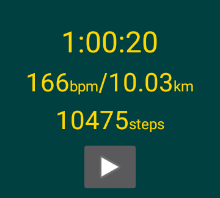
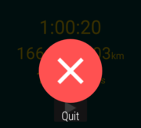
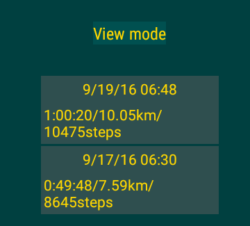
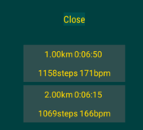
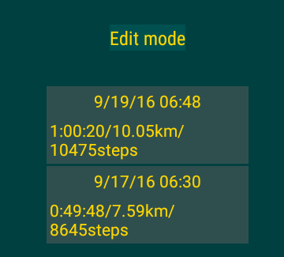
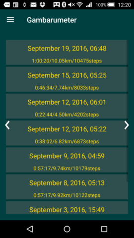
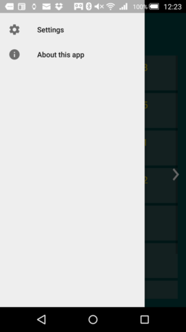
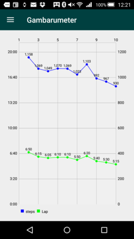
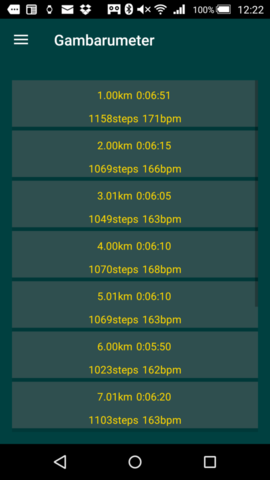

        
        
          
            <a href="{{ site.baseurl }}{{ page.url }}" class="{{ page.lang }}">{{ page.lang }}</a>
          
        

Gambarumeterは、心拍数、距離、歩数を計測するアプリケーションです。
Android Wear搭載のスマートウォッチおよびAndroid 4.3以上を搭載したスマートフォンが必要です。
アプリケーションの動作時にはスマートフォンは必要ありません。単独で動作します。

## 目次

- [スマートウォッチ](#Watch)
- [スマートフォン](#Phone)

## スマートウォッチ

### メイン画面

起動するとメイン画面が表示されます。

ボタンをタップ、または画面上のどこかをダブルタップすると計測を開始します。
同じボタンをタップ、または画面上のどこかをダブルタップすると計測を終了します。 

距離を計測できるスマートウォッチの場合、システム設定画面で「位置情報」をONにして起動してください。
最初は距離表示が「-.--km」になっています。最初の位置情報を実際に受け取ると「0.00km」に変わり、距離の計測ができるようになります。

画面のどこかを長押しするとアプリケーションを終了できます。

### 履歴画面

右にスワイプすると過去の記録が表示されます。

履歴画面には「閲覧モード」と「編集モード」があります。

「閲覧モード」では、特定の行をタップするとその記録の詳細が表示されます。

「編集モード」では、特定の行をタップするとその記録を削除できます。削除の前に確認ダイアログが表示されます。

「閲覧モード」をタップすると編集モード、「編集モード」をタップすると閲覧モードに切り替わります。

### 通知

計測中は画面下部に通知が表示されます。通知をタップするとメイン画面が表示されます。

### 音声コマンド

スマートフォンに接続した状態の場合、音声でアプリケーションを開始できます。

「ランニング開始」または「ワークアウト開始」でアプリケーションが起動して計測を開始します。
「ランニング終了」「ワークアウト開始」は使えません。計測中の記録が消えてしまうのでご注意ください。

## スマートフォン

### メイン画面

メイン画面には過去の記録が表示されます。

詳細を見たい場合はその行をタップします。長押しすると記録を削除できます。

### 詳細画面

詳細画面では、マップ、グラフ、スプリットタイムを見ることができます。
ドロワーメニューを開いて切り替えてください。

TCX形式のファイルをエクスポートすることもできます。

